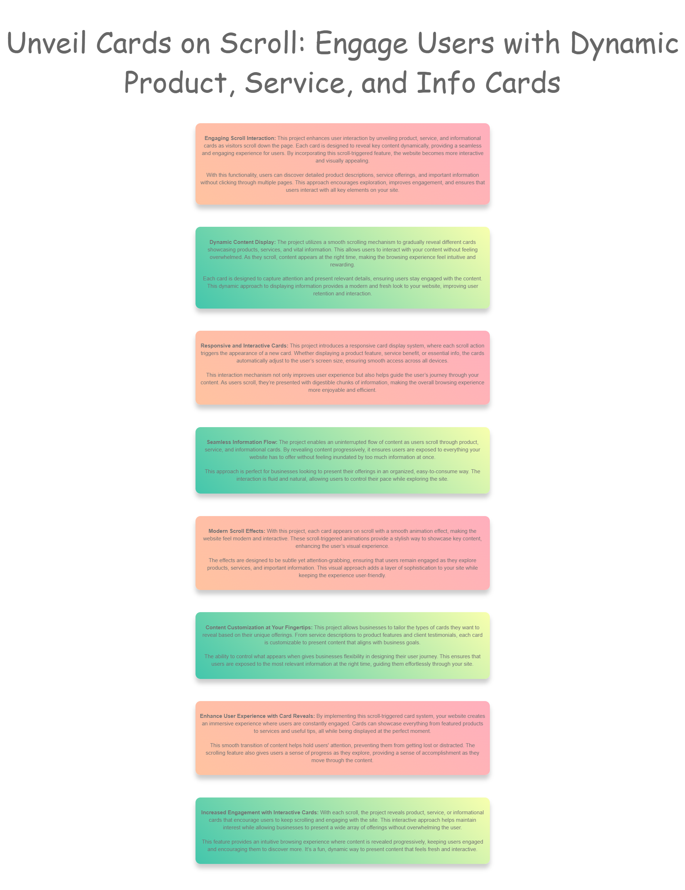
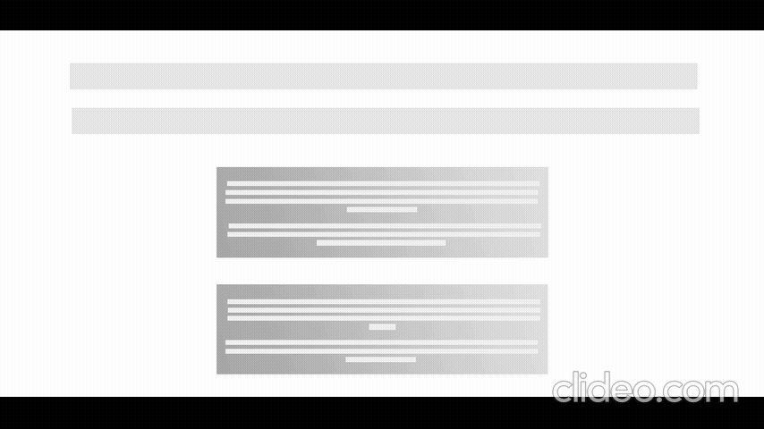
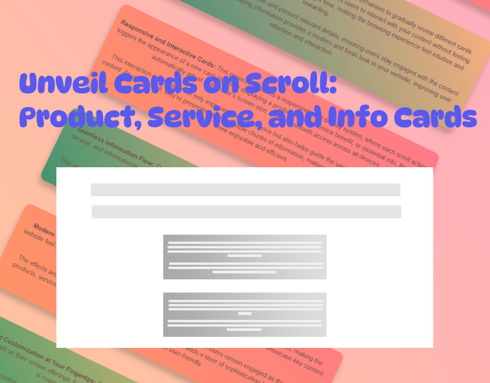

# Unveil Cards on Scroll: Product, Service, and Info Cards

### Author
##### Virendra D. Verma

<a href="https://www.linkedin.com/in/dharmendraverma95/" target="_blank">LinkedIn Profile </a>

<a href="https://www.behance.net/dhirukumar" target="_blank">Behance Profile </a>

# Project Overview

Unveil Cards on Scroll is a web project that enhances user interaction and engagement by revealing product, service, and informational cards dynamically as users scroll through the page. This feature provides a smooth and visually appealing way to showcase various content types without overwhelming the visitor. By implementing scroll-triggered animations, the project aims to create an immersive, intuitive browsing experience that improves user retention and exploration.

## Features
- Scroll-Triggered Card Display: Product, service, and info cards reveal progressively as users scroll down the page, creating a fluid and engaging experience.

- Responsive Design: The cards are designed to adjust seamlessly to different screen sizes, ensuring an optimized user experience across all devices (desktop, tablet, mobile).

- Smooth Animation Effects: Subtle animations make each card appear on scroll, drawing attention and enhancing the visual appeal of your website.

- Customizable Content: Cards can be tailored to display various types of content including products, services, testimonials, or key information, giving businesses full control over their content layout.

- Interactive User Journey: The scroll interaction encourages users to explore more content without the need for clicks, improving website interactivity.

# Preview
Unveil Cards on Scroll: Product, Service, and Info Cards
 

 
Unveil Cards on Scroll: Product, Service, and Info Cards Start & End Point 
 

 
Unveil Cards on Scroll: Product, Service, and Info Cards UI UX Layout Start & End Point
 

 
Unveil Cards on Scroll: Product, Service, and Info Cards UI UX Layout
 

 
Cover
 

 

### Technologies Used
<ul>
  <li>Graphic Design Software: Photoshop, Figma (for mockups)</li>
  <li>Web Tools (Optional): HTML5, CSS3 and JavaScript (Vanilla JS or jQuery for animation effects)  for any digital presentations or landing pages</li>
  <li>Scroll Animations (CSS animations)</li>
</ul>

###  Acknowledgments
Inspired by the power of CSS positioning and scrolling techniques.